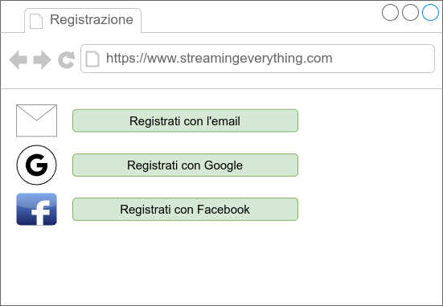
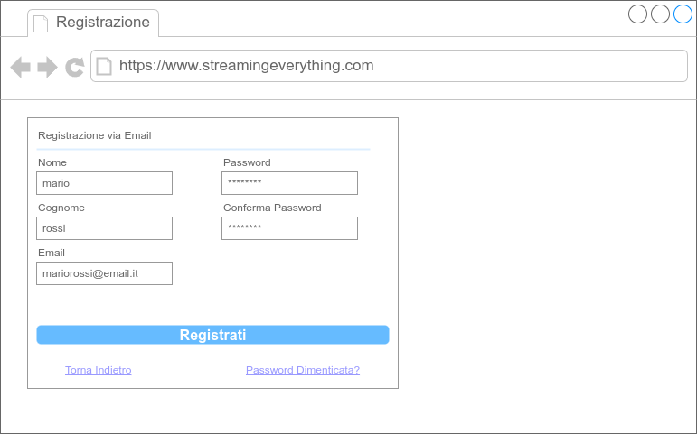

# Caso d'Uso: RegistraAccount
## Breve Descrizione: L'utente si registra alla piattaforma StreamingEveryThing
## Attori primari: Utente Anonimo
## Attori secondari: Google, Facebook, Card Payment Provider, PayPal
## Precondizioni: Nessuna
## Sequenza degli eventi principale:
1. L'utente accede alla pagina di registrazione
2. L'utente sceglie il metodo di registrazione tra quelli disponibili
    
    1. **Se** l'utente sceglie la registrazione via email
        1. Il sistema visualizza la schermata per l'inserimento delle credenziali
        
        2. L'utente inserisce i dati necessari per la registrazione
        3. L'utente conferma l'operazione
        4. Il sistema invia una email di conferma all'utente
        5. L'utente conferma la registrazione tramite l'email ricevuta
    2. **Altrimenti se** l'utente sceglie la registrazione via Google
        1. L'utente si autentica tramite il servizio esterno Google
    3. **Altrimenti se** l'utente sceglie la registrazione via Facebook
        1. L'utente si autentica tramite il servizio esterno Facebook
3. Il sistema mostra all'utente la pagina per scegliere il suo tipo di abbonamento
4. L'utente sceglie l'abbonamento base o premium
5. **Se** l'utente sceglie l'abbonamento premium
    1. include(EseguePagamento)
6. Il sistema informa l'utente che la creazione dell'account è avvenuta con successo
## Postcondizioni: Un nuovo account di tipo base o premium è stato creato per l'utente
## Sequenza degli eventi alternativa: AutenticazioneEsternaFallita, EmailNonConfermata, PagamentoNonRiuscito