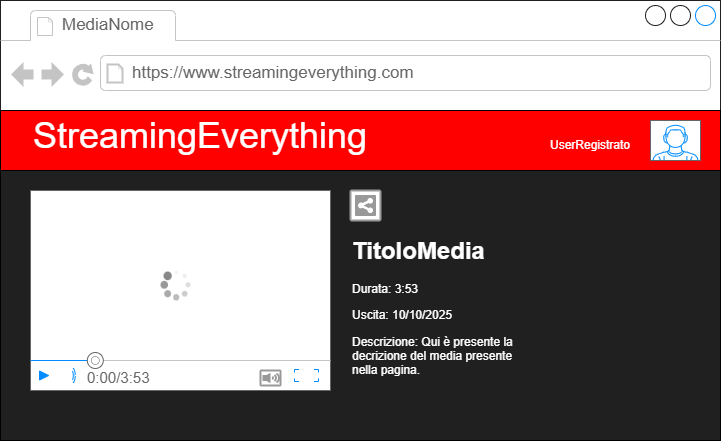

# Caso d'Uso: VisualizzaMedia
## Breve Descrizione: L’utente riproduce in streaming un film del catalogo base
## Attori primari: Utente Registrato
## Attori secondari: Nessuno
## Precondizioni: Nessuna
## Sequenza degli eventi principale:
1. L'utente apre il media da guardare dal catalogo base
2. Il sistema visualizza la pagina del media
3. L'utente preme il pulsante "play"

4. **Se** il sistema rileva un punto salvato
    1. Il sistema avvia lo streaming dal punto salvato
5. **Altrimenti**
    1. Il sistema avvia lo streaming dall'inizio
6. Alla pausa o uscita il sistema salva il punto in cui si rimane con la visione del media
## Postcondizioni: Posizione di visione aggiornata
## Sequenza degli eventi alternativa: MediaNonDisponibile, ConnessionePersa

# Caso d'Uso: VisualizzaMediaPremium
## Breve Descrizione: L’utente riproduce in streaming un film del catalogo premium
## Attori primari: Utente Premium
## Attori secondari: Nessuno
## Precondizioni: Nessuna
## Sequenza degli eventi principale:
1. (o1) L'utente premium apre il media da guardare dal catalogo base
2. (2) Il sistema visualizza la pagina del media
3. (o3) L'utente premium preme il pulsante "play"

4. (4) **Se** il sistema rileva un punto salvato
    1. (4.1) Il sistema avvia lo streaming dal punto salvato
5. (5) **Altrimenti**
    1. (5.1) Il sistema avvia lo streaming dall'inizio
6. (6) Alla pausa o uscita il sistema salva il punto in cui si rimane con la visione del media
## Postcondizioni: Posizione di visione aggiornata
## Sequenza degli eventi alternativa: UtenteNonPremium, MediaNonDisponibile, ConnessionePersa